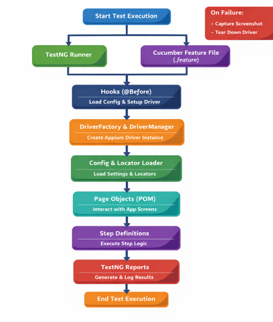

# blukers_automation
Test Automation for Blukers App

## **Features of the framework:**
- Cross-platform
- Scalable, Layered Architecture
- Multi threaded
- BDD-Driven Test Design
- Centralized Configuration Management
- Dynamic, no hardcoded configuration, capable to handle runtime configuration
- Separate test data files
- Centralized before and after test processes 
- Reusability is maximized to it's best
- Faster performance is ensured through caching for loading locators
- Design Patterns are implemented:
  - Separation of concern
  - Closed to modification, open to extension
  - Factory method to create drivers
  - Singleton class for Driver initiation 
- CI/CD incorporated (Not done yet)
- Logging for easy root cause identification
- Enhance reporting (Email able report, notification)

## **Compoent Diagram:**

## ** Test Execution Flow **##
